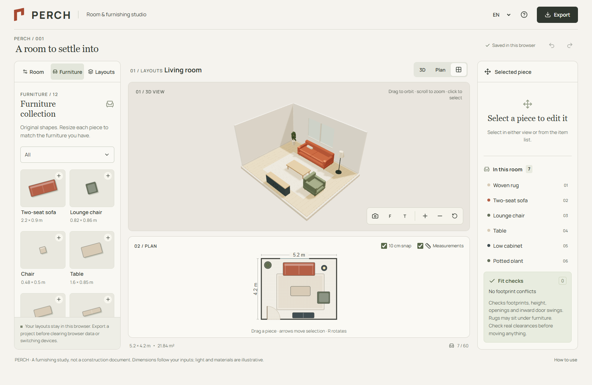

# PERCH

**Try a few layouts before you move a single chair.**

[Open the room studio](https://seoshiro.github.io/perch-studio/) · [Checks](https://github.com/seoshiro/perch-studio/actions)



PERCH is a browser-local room and furnishing studio. Set a rectangular room's dimensions, add doors and windows, resize furniture to match what you own, and compare alternatives before making a move.

- **One shared model, two working views.** Drag in the dimensioned plan; select and orbit in 3D. Numerical fields and arrow buttons provide a precise alternative to dragging.
- **12 original parametric pieces.** Seating, tables, beds, storage, rugs, plants and lighting, with editable width, depth, height, rotation and finish.
- **Useful fit notes.** Rotated footprints, room boundaries, ceiling height, inward door swings and overlapping openings. Rugs can sit under furniture.
- **Layout alternatives.** Name and duplicate up to eight independent layouts, start from three furnished rooms, and compare plans side by side.
- **Local saves and recovery.** Automatic browser storage, one previous valid backup, undo/redo, and clear handling of corrupt data or unavailable storage.
- **Portable exports.** Versioned JSON, dimensioned SVG, PNG from the current 3D angle, and a printable room report that can be saved as PDF.
- **EN / RU / KK.** Keyboard controls, visible focus, reduced motion, a working 2D fallback, touch controls and deliberate phone layouts.

## Run locally

Node.js 24 and npm are required.

```sh
npm ci --ignore-scripts
npm run dev
```

The local editor opens at `http://127.0.0.1:5418`. For the production build:

```sh
npm run build
npm run preview
```

## Verify

```sh
npm run typecheck
npm run lint
npm test
npm run build
npm run test:browser
```

Browser tests use installed Chrome on Windows. CI installs Playwright Chromium on Linux. To use the latter locally, set `CI=1` after running `npx playwright install chromium`. `LIVE_URL` runs the same browser checks against a deployed URL ending in `/`.

The release was developed through three separate audit/fix rounds: geometry/data, interaction/accessibility/localization, and performance/mobile/release. See [audit notes](docs/AUDITS.md) and [model and renderer notes](docs/ARCHITECTURE.md).

## Practical limits

This is a furnishing study, not a construction or safety document. Dimensions follow your inputs; materials and light are illustrative. The room is rectangular, doors swing inward, and collision notes use footprints rather than detailed furniture surfaces or walking-clearance standards. Items may be left outside the room while you experiment; fit notes identify them.

Projects stay in this browser's storage. Export JSON before clearing browser data or moving devices. There is no account, backend, cloud synchronization, real-time collaboration, scanning, or promised offline installation. The app makes no external runtime data requests; GitHub Pages still serves its static files.

Limits: 2–12 m room sides, 2–4 m room height, 60 pieces and 8 openings per room, 8 layouts, and 256 KB imports. WebGL is optional; the plan and forms remain usable when 3D is unavailable. Validation used automated Chrome/Chromium and emulated viewports, not a physical phone or a Safari certification.

## License

Original code and parametric assets: [MIT](LICENSE). [Third-party licenses](docs/THIRD_PARTY.md), including Manrope's SIL Open Font License, are retained. PERCH is the chosen product name; repository availability is not trademark clearance.
